# DEPLOYMENT


### Initial steps

1. Since this was my first time developing project in local environment using VS code and not cloud
based IDE the deployment process will follow the path specific to a local environment deployment.

- Creating a repository with Project name
- Setting up local environment `python -m venv .venv`
 virtual environment is a recommended practice when working on Python projects, as it helps isolate project dependencies and avoids conflicts with other Python packages installed on your system.

- Install packages and dependencies needed for developing the project and "freeze" them in a requirements.txt file created on base level  `pip freeze > requirements.txt`

- create "env.py" to store all sensitive data and IMPORTANT: include this file in gitignore file so that sensitive data is not exposed in github repo.

### Creating a Database

1. To generate a managed PostgreSQL database,  visit the [ElephantSQL](https://customer.elephantsql.com/ ) website  and either create a new account or log in to your existing account. After successfully logging in, follow the steps below to proceed with generating the database
    - Navigate to the dashboard or homepage of your ElephantSQL account.
    - click on the 'Create New Instance' button
        <details><summary>See Image</summary>

        
        </details>

    -  Name your database and select the 'Tiny Turtle' payment plan. Then, click on 'Select Region'
    <details><summary>See Image</summary>

    
    </details>

    -  Select your preferred region and create the database instance.
    After creating the instance, navigate to the instances page and click on the name of the database you selected earlier. Then, in the details section on the following page, copy the PostgreSQL URL.
    <details><summary>See Image</summary>

    
    </details>

    - Copy database Url cause its needed for heroku:
        <details><summary>See Image</summary>

        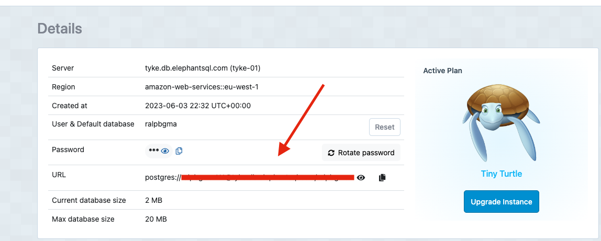
        </details>

***
### Heroku Initial
 - Initial steps: Few things need to be prepared before initiating deployment to Heroku
    - `SECRET_KEY` variable should be generated in env.py file that will be added to Heroku.
        <details><summary>See Image</summary>

        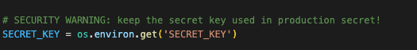
        </details>

    - `DATABASE_URL` variable should be generated in env.py file that will be added to Heroku.
        <details><summary>See Image</summary>

        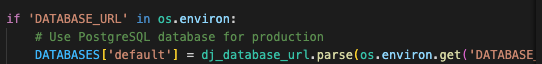
        </details>

 - creating an App
    -  sign up or sign in to your Heroku account. Next, create a new app from the Heroku dashboard.
        <details><summary>See Image</summary>

        
        </details>

    - Choose a unique name for your app and enter the region.Then, click  on the 'Create App' button.
        Once your app has been created, select the 'Settings' tab from the dashboard and navigate to 'Reveal Config Vars'. From there, go to setting tab of your app and in config vars menu paste the:
         <details><summary>See Image</summary>

        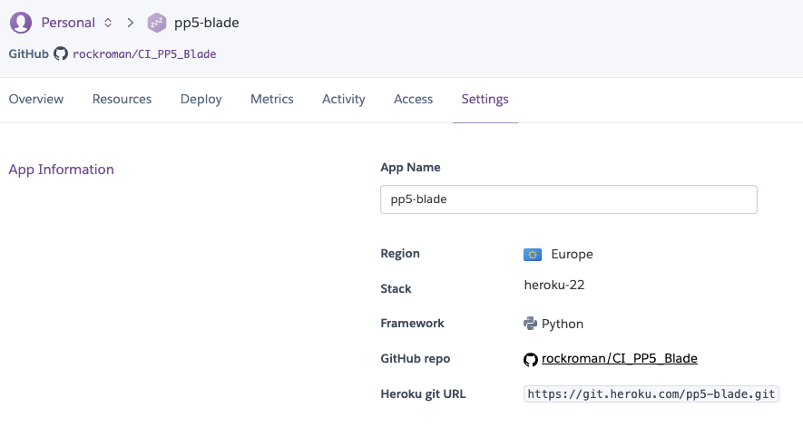
        </details>
        - ElephantSQL Database URL into the DATABASE_URL environment variable.
        - SECRET_KEY variable  into the SECRET_KEY environment variable.
        - add DISABLE_COLLECTSTATIC variable with value of 1 (for initial deployment, later this variable can be removed)

        <details><summary>See Image</summary>

        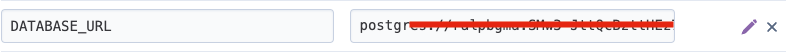
        </details>

        <details><summary>See Image</summary>

        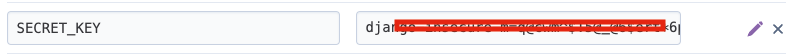
        </details>

***


### Stripe payment gateway

- Create an account or login  to  [Stripe](https://dashboard.stripe.com/)
- Navigate to home tab


<details><summary>See Image</summary>

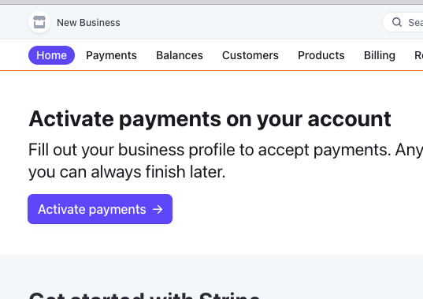
</details>

- under developers section copy the values of:
 `SECRET_KEY ` and `PUBLIC_KEY`


<details><summary>See Image</summary>

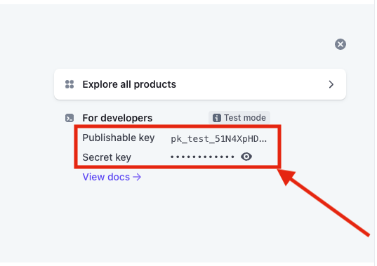
</details>

- Navigate to developer section of stripe dashboard
and Click on the `webhooks` tab to add an endpoint

<details><summary>See Image</summary>

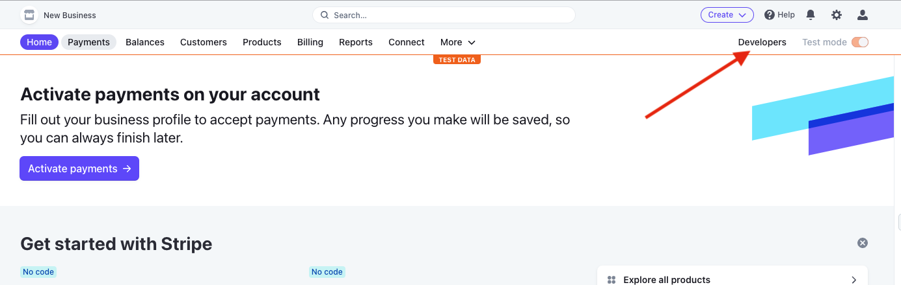
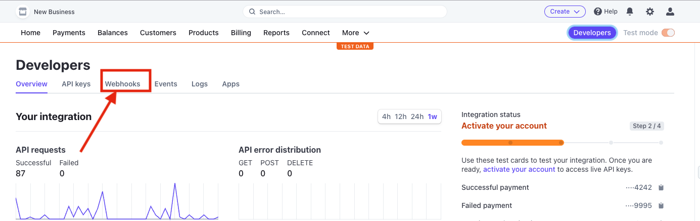
</details>

- Create a webhook with url of deployed project in this format
https://yourwebsite.com/checkout/wh/

<details><summary>See Image</summary>

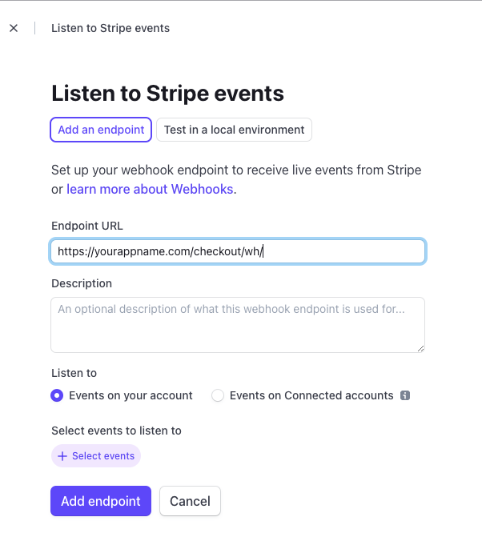
</details>


- Choose events the webhook will receive(payment intent events) and
add endpoint
<details><summary>See Image</summary>

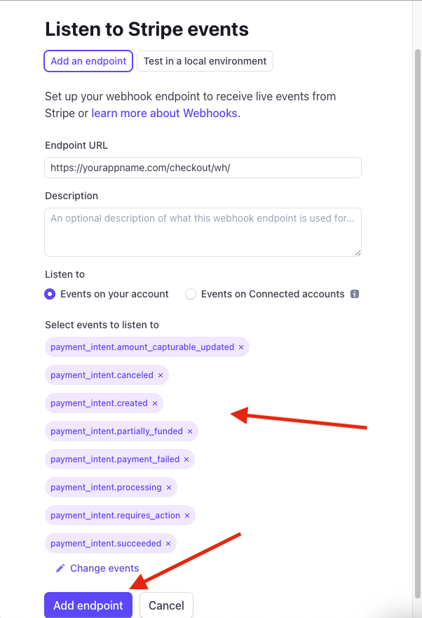
</details>

- Ensure your webhook is working by doing test with various events

<details><summary>See Image</summary>

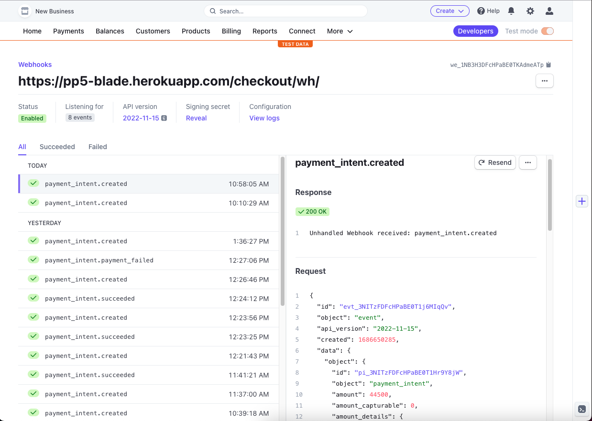
</details>


- Add those keys as env variables to your env.py file and settings.py file while later those values

<details><summary>See Image</summary>

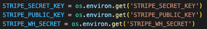
</details>
will be needed for heroku deployment

***


### AWS (S3 bucket):

- Sign in or create an account on  [AWS](https://signin.aws.amazon.com/)


1. Create a new S3 bucket:
    * Navigate and Click "Services" in the top left-hand corner of the landing page, click on "Storage" then click "S3."
    * Navigate and Click "Create bucket."
    * Give the bucket a unique name:
        * Will form part of the URL (in the case of this project, I called the S3 bucket pp5-blade)
    * Select the nearest location:
        * My case EU (Ireland) eu-west-1.
    * Under the "Object Ownership" section, select "ACLS enabled"
    * Under the "Block Public Access settings for this bucket" section, untick "Block all public access" and tick the box to acknowledge that this will make the bucket public.
    * Navigate and Click "Create bucket."
2. Edit Bucket settings:
    * Bucket Properties: -
       * Navigate and Click on the bucket name to open the bucket.
       * Navigate and Click on the "Properties" tab.
       * Under the "Static website hosting" section, click "Edit."
       * Under the "Static website hosting" section select "Enable".
       * Under the "Hosting type" section ensure "Host a static website" is selected.
       * Under the "Index document" section enter "index.html".
       * Navigate and Click "Save changes."
    * Bucket Permissions: -
       * Navigate and Click on the "Permissions" tab.
       * Scroll down to the "CORS configuration" section and click edit.
       * Enter the following snippet into the text box:

       ```JSON
            [
                {
                    "AllowedHeaders": [
                    "Authorization"
                    ],
                    "AllowedMethods": [
                    "GET"
                    ],
                    "AllowedOrigins": [
                    "*"
                    ],
                    "ExposeHeaders": []
                }
            ]
        ```

       * Navigate and Click "Save changes."
       * Scroll back up to the "Bucket Policy" section and click "Edit."
       * Take note of the "Bucket ARN" click on the "Policy Generator" button to open the AWS policy generator in a new tab.
       * In the newly opened tab under Step 1 "Select Policy Type" select "S3 Bucket Policy." from the drop down menu.
       * Under Step 2 "Add Statement(s)" enter " * " in the "Principal" text box.
       * From the "s3:Action" drop down menu select "s3:GetObject".
       * Enter the "ARN" noted from the bucket policy page into the "Amazon Resource Name (ARN)" text box.
       * Navigate and Click "Add Statement."
       * Under Step 3 "Generate Policy" click "Generate Policy."
       * Copy the resultant policy and paste it into the bucket policy text box on the previous tab.
       * In the same text box add "/*" to the end of the resource key to allow access to all resources in this bucket.
       * Navigate and Click "Save changes."
       * When back on the buckets permissions tab, scroll down to the "Access Control List" section and click "Edit."
       * enable "List" for "Everyone (public access)", tick the box to accept that "I understand the effects of these changes on my objects and buckets."  and click "Save changes."

        <details><summary>See Image quick guide</summary>

        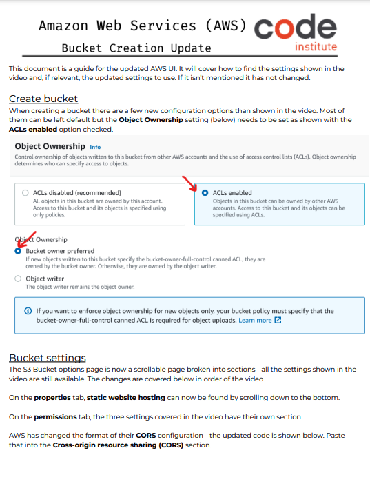
        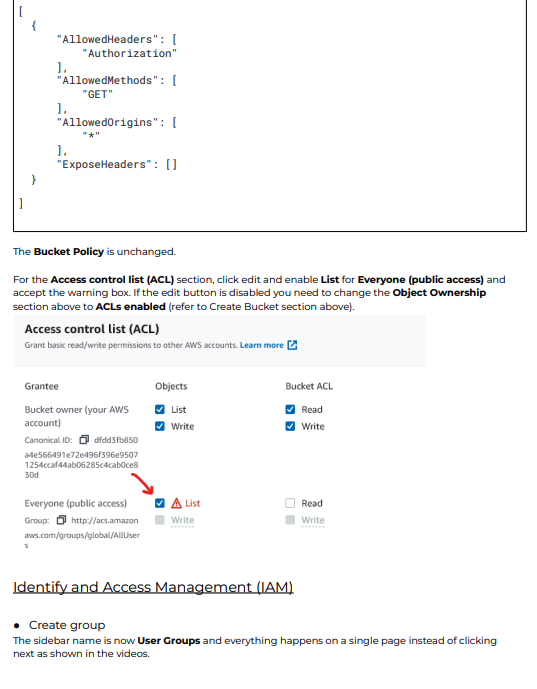
        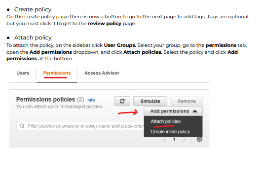
        </details>


3. Create AWS static files User and assign to S3 Bucket:
    * Create "User Group": -
        * Navigate and Click "Services" in the top left-hand corner of the landing page, from the left side of the menu click on "Security, Identity, & Compliance" and select "IAM" from the right side of the menu.
        * Under "Access management" click "User Groups."
        * Navigate and Click "Create Group."
        * Enter a user name .
        * Scroll to the bottom of the page and click "Create Group."
    * Create permissions policy for the new user group: -
        * Navigate and Click "Policies" in the left-hand menu.
        * Navigate and Click "Create Policy."
        * Navigate and Click "Import managed policy."
        * Search for "AmazonS3FullAccess", select this policy, and click "Import".
        * Navigate and Click "JSON" under "Policy Document" to see the imported policy
        * Copy the bucket ARN from the bucket policy page and paste it into the "Resource" section of the JSON snippet. Be sure to remove the default value of the resource key ("*") and replace it with the bucket ARN.
        * Copy the bucket ARN a second time into the "Resource" section of the JSON snippet. This time, add "/*" to the end of the ARN to allow access to all resources in this bucket.
        * Navigate and Click "Next: Tags."
        * Navigate and Click "Next: Review."
        * Navigate and Click "Review Policy."
        * Enter a name for the policy.
        * Enter a description for the policy.
        * Navigate and Click "Create Policy."
    * Attach Policy to User Group: -
        * Navigate and Click "User Groups" in the left-hand menu.
        * Navigate and Click on the user group name created during the above step.
        * Select the "Permissions" tab.
        * click "Attach Policy."
        * Search for the policy created during the above step, and select it.
        * Navigate and Click "Attach Policy."
    * Create User: -
        * Navigate and Click "Users" in the left-hand menu.
        * Navigate and Click "Add user."
        * Enter a "User name" .
        * Select "Programmatic access" and "AWS Management Console access."
        * Navigate and Click "Next: Permissions."
        * Select "Add user to group."
        * Select the user group created during the above step.
        * Navigate and Click "Next: Tags."
        * Navigate and Click "Next: Review."
        * Navigate and Click "Create user."
        * Take note of the "Access key ID" and "Secret access key" as these will be needed to connect to the S3 bucket.
        * Navigate and Click "Download .csv" to download the credentials.
        * Navigate and Click "Close."

4. Connect S3 Bucket to Project by adding folloeing code t
your settings.py file:

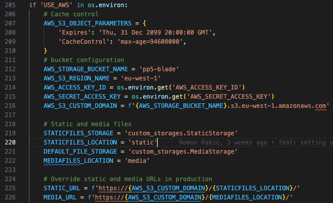

### Finish Heroku configuration for deployment

1. Add following config. variables to heroku

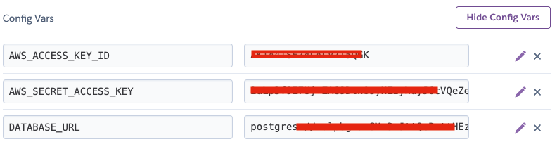
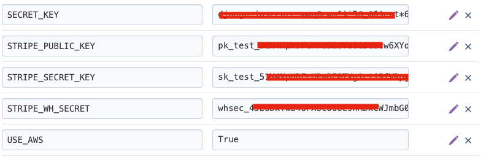

2. Select Deploy option from the heroku dashboard 'tabs'

<details><summary>See Image</summary>

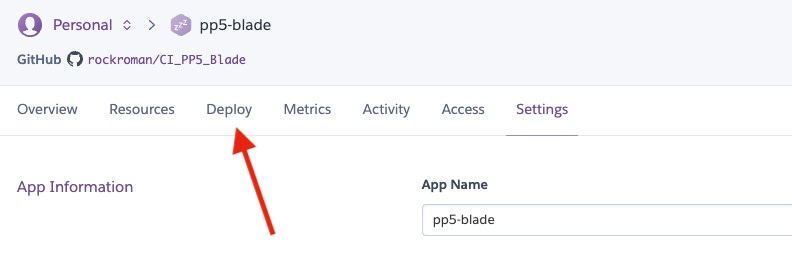
</details>

3. From Deployment method section choose Connect to GitHub and click on it

<details><summary>See Image</summary>


</details>

4. Find your github repository by name and connect

<details><summary>See Image</summary>

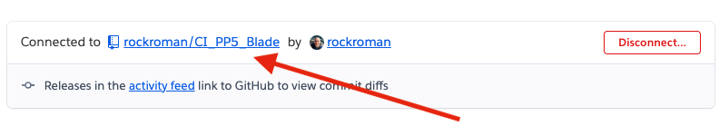
</details>

5. At the bottom of the page choose either automatic deployment manual deployment(deploy by branch) choose an option and DEPLOY the project

<details><summary>See Image</summary>

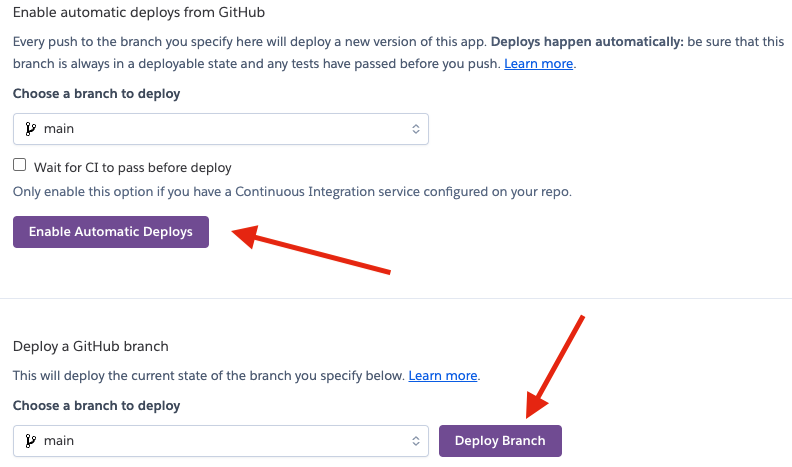
</details>
